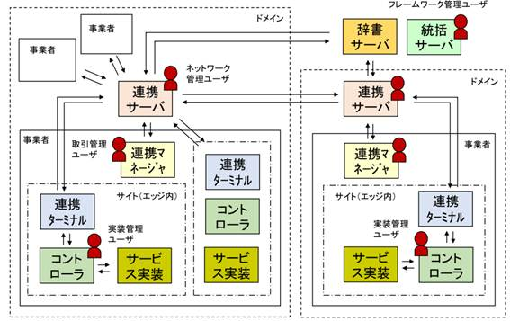
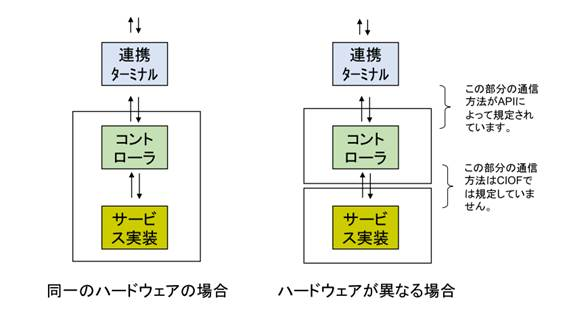

# CIOF システムAPIリファレンスマニュアル v2.3.3

# 1 システム構成

CIOFシステム全体アーキテクチャおよび今回説明する対象であるコントローラの位置付けおよびAPIの規定範囲は、次の図で示す通りです。

  


# 2 APIリファレンスガイド

## 2.1 通信プロトコル

HTTP/1.1 [^1] に準拠します。


## 2.2 パラメータの形式

通信に用いる文字コードはUTF-8(BOMなし)とします。

要求パラメータおよび応答パラメータは、JSON形式とします。


## 2.3 HTTPステータスコード

本書で説明するAPIは、次に示す標準的なHTTPのステータスコードを使用します。
ただし、APIによっては、本節に記載のないステータスコードを応答する場合があり、その場合はAPI毎に別記載しています。

- **200 Success**: リクエストが適切に処理されたことを示します。
- **201 Created**: リクエストが正常に完了し、新たなリソースが作成されたことを示します。
- **400 Bad request**: リクエストヘッダ、クエリパラメータ、またはリクエストボディが不正であることを示します。該当箇所の確認をお願いします。
- **401 Unauthorized**: 認証に失敗したことを示します。ヘッダ内のBearer tokenを確認してください。
- **404 Not Found**: リクエストされたリソースが見つからないことを示します。URLパスやIDが正しいか確認してください。
- **422 Unprocessable Entity**: リクエストの構文は正しいが、セマンティックエラーにより処理できないことを示します。
- **500 Internal Server Error**: サーバで内部エラーが発生したことを示します。別途、定められた手続きにより問い合わせください。
- **502 Bad Gateway**: 連携ターミナルランチャーの設定が誤っており、連携ターミナルとうまく接続ができていないことを示します。連携ターミナルランチャーのポート設定が誤っている場合がほとんどですが、ポート設定が正しいにもかかわらず、該当エラーが続く場合は、定められた手続きにより問い合わせください。
- **503 Service Unavailable**: 連携ターミナルが起動していないことを示します。しばらく待って再度APIを実行してください。


## 2.4 CIOFエラーコード

本書で説明するAPIは、HTTPステータスコードの他に独自のエラーコードを応答する予定です。エラーコードの内容については、今後のバージョンアップにて順次対応予定です。


## 2.5 ユーザ認証

コントローラによる連携ターミナルへの接続には、RFC6750 [^2] の規定に基づき、Bearer認証のパラメータをHTTPのAuthorizationヘッダに含めます。


## 2.6 コントローラ – 連携ターミナル間API規定

サイトごとに配置されている連携ターミナルは、コントローラに対して以下の14のAPIを提供します。
それぞれのコントローラは、あらかじめ連携マネージャを用いて取得した認証コード [^3] を用いてこれらのAPIにアクセスします。

- **[コントローラの状態通知](#271-コントローラの状態通知)**: コントローラの起動および終了を通知します。
- **[サービス実装の取得](#272-サービス実装の取得)**: サービス実装、プロセス実装、イベント実装の構造を取得します。
- **[サービス実装の状態通知](#273-サービス実装の状態通知)**: サービス実装、プロセス実装、イベント実装の状態を通知します。
- **[データ実装の取得](#274-データ実装の取得)**: データ実装、データ項目実装の構造を取得します。
- **[データ実装の状態通知](#275-データ実装の状態通知)**: データ実装、データ項目実装の状態を通知します。
- **[取引契約の取得](#276-取引契約の取得)**: 取引契約の内容を取得します。
- **[カレンダの取得](#277-カレンダの取得)**: カレンダの定義を取得します。
- **[取引データの取得](#278-取引データの取得)**: 取引データを取得します。
- **[取引データの送信](#279-取引データの送信)**: 契約内容に基づき取引データを送信します。
- **[リクエストパラメータの取得](#2710-リクエストパラメータの取得)**: リクエストパラメータを取得します。
- **[リクエストパラメータの送信](#2711-リクエストパラメータの送信)**: リクエストパラメータを送信します。
- **[データファイルの送信](#2712-データファイルの送信)**: データファイルを送信します。
- **[サービス記録の通知](#2713-サービス記録の通知)**: サービス記録を送信します。
- **[サービス記録の取得](#2714-サービス記録の取得)**: サービス記録を取得します。

次節以降で、上記14のAPIの仕様について記載します。

## 2.7 各APIの仕様


### 2.7.1 コントローラの状態通知

本APIは、コントローラの状態をCIOFに伝えるためのものです。
コントローラは、起動・終了した際に、その時の状態をCIOFシステムに通知する必要があります。
次にAPIの利用パターンを示します。

1. コントローラが電源ONし、通信が可能となったタイミングで、コントローラ状態通知APIにて、statusをreadyとすると同時に、polling_rateを設定します。
2. 電源OFF時は、コントローラ状態通知APIにて、statusをdisconnectedとします。

これら対応によって、CIOFシステムにコントローラの状態が通知されますが、それによって通信に制限がかかることはありません。
管理者は連携マネージャから、コントローラのステータスを確認することができます。

- **HTTPメソッド**: PUT
- **URLパス**: `/hct/api/v2/controller`
- **要求ヘッダ**: [^4]
  ```
  Content-Type: application/json
  Authorization: Bearer token=<authorization_key>
  ```
- **要求パラメータ**: メッセージボディ部に、以下のパラメータを与えます。
  ```json
  {
    "status": "ready",
    "polling_rate": 60
  }
  ```
  | 属性 | 型 | 常に存在 | 説明 |
  | --- | --- | --- | --- |
  | status | string | | コントローラのステータス <ul><li>**ready**: 稼働中</li><li>**disconnected**: 未接続</li><li>**stopped**: 停止中</li></ul> |
  | polling_rate | number | | コントローラから連携ターミナルへのポーリングレートを秒単位で示します。10秒～1000秒の範囲とします |
- **応答ステータスコード**: [2.3節](#23-httpステータスコード)に準じます。
  | ステータスコード | 内容 |
  | --- | --- |
  | 200 | リクエストが正常に完了しました。 |
  | 422 | polling_rateが規定の範囲外である場合に応答されます。 |
- **応答ヘッダ**:
  ```
  Content-Type: application/json
  ```
- **応答パラメータ**: メッセージボディ部に、以下のパラメータを返します。
  ```json
  {
    "status": "ready",
    "polling_rate": 60
  }
  ```
  | 属性 | 型 | 常に存在 | 説明 |
  | --- | --- | --- | --- |
  | status | string | ✓ | 変更したコントローラのステータス <ul><li>**ready**: 稼働中</li><li>**disconnected**: 未接続</li><li>**stopped**: 停止中</li></ul> |
  | polling_rate | number | | 変更したコントローラから連携ターミナルへのポーリングレートを秒単位で示します。10秒～1000秒の範囲とします |


### 2.7.2 サービス実装の取得

サービス実装、プロセス実装、イベント実装の構造を取得します。
ここで取得される情報は、あらかじめ連携マネージャを利用して、CIOFシステムに登録されたものです。
コントローラは、本APIによって得られた情報が、配下のサービス実装、プロセス実装、イベント実装に関する実際の構成（リアル世界における構成）と同じであることを確認しなければなりません。
もし、実際の構成と異なる場合は、連携マネージャを利用して、CIOFシステムに登録された内容を修正したうえで、コントローラによって再度修正された構成情報を取得する必要があります。

- **HTTPメソッド**: GET
- **URLパス**: `/hct/api/v2/service_implementations`
- **要求ヘッダ**: [^4]
  ```
  Content-Type: application/json
  Authorization: Bearer token=<authorization_key>
  ```
- **要求パラメータ**: なし
- **応答ステータスコード**: [2.3節](#23-httpステータスコード)に準じます。
  | ステータスコード | 内容 |
  | --- | --- |
  | 200 | サービス実装情報を正常に取得しました。 |
- **応答ヘッダ**:
  ```
  Content-Type: application/json
  ```
- **応答パラメータ**: メッセージボディ部に、以下のパラメータを返します。
  ```json
  [
    {
      "id": "10501",
      "local_id": "x5VrQsPfiqrzc2J",
      "name": "環境情報取得サービス",
      "description": "環境データを取得する",
      "device_id": [
        "device001"
      ],
      "process_implementations": [
        {
          "id": "10601",
          "local_id": "ShN69VWpC9",
          "name": "温湿度の計測",
          "description": "温度を計測して、値を応答する",
          "process_operation_implementations": [
            {
              "id": "10701",
              "index": 1,
              "data_implementation_id": "10901",
              "operation_type": "create"
            }
          ],
          "event_implementations": [
            {
              "id": "10801",
              "local_id": "ThSf7UaGDUnd",
              "event_type": "trigger",
              "name": "計測開始",
              "description": "計測を開始するトリガとなるイベント"
            }
          ]
        }
      ]
    }
  ]
  ```
  | 属性 | 型 | 常に存在 | 説明 |
  | --- | --- | --- | --- |
  | id | string | ✓ | サービス実装のID |
  | local_id | string | ✓ | サービス実装の内部ID |
  | name | string | | サービス実装の名称（実装の元となったモデルの名称） |
  | description | string | | サービス実装の簡単な説明（実装の元となったモデルの説明） |
  | device_id | string[] | ✓ | サービス実装が実際に実装されているデバイスIDの配列 |
  | process_implementations | ProcessImplementation[] | ✓ | プロセス実装の配列 |

  ProcessImplementation 型

  | 属性 | 型 | 常に存在 | 説明 |
  | --- | --- | --- | --- |
  | id | string | ✓ | プロセス実装のID |
  | local_id | string | ✓ | プロセス実装の内部ID |
  | name | string | | プロセス実装の名称（実装の元となったモデルの名称） |
  | description | string | | プロセス実装の簡単な説明（実装の元となったモデルの説明） |
  | process_operation_implementations | ProcessOperationImplementation[] | ✓ | プロセス手順実装の配列 |
  | event_implementations | EventImplementation[] | ✓ | イベント実装の配列 |

  ProcessOperationImplementation 型

  | 属性 | 型 | 常に存在 | 説明 |
  | --- | --- | --- | --- |
  | id | string | ✓ | プロセス手順実装のID |
  | index | number | ✓ | 1からの通し番号 |
  | data_implementation_id | string | ✓ | プロセスによって生成、利用、改変、または削除されるデータ実装のID |
  | operation_type | string | ✓ | 操作種別 <ul><li>**create**: 生成</li><li>**read**: 利用</li><li>**update**: 改変</li><li>**delete**: 削除</li></ul> |

  EventImplementation 型

  | 属性 | 型 | 常に存在 | 説明 |
  | --- | --- | --- | --- |
  | id | string | ✓ | イベント実装またはカレンダのID。ここで取得されるイベント実装は、該当するサービス実装に紐づくイベント実装のうち、以下の条件を満たすものです。 ①イベントプロファイルが存在し、記録可能 [^5] であるもの(event_type = monitoringであるもの) ②イベントプロファイルが存在し、トリガ実装が存在するトリガとなるイベント実装であるもの(event_type = triggerであるもの) ③カレンダが存在し、トリガとなっているもの（idがカレンダIDで、event_type = triggerであるもの） |
  | local_id | string | ✓ | イベント実装の内部ID |
  | name | string | ✓ | イベントの特徴を表す名称 |
  | event_type | string | | <ul><li>**trigger**: トリガ</li><li>**monitoring**: モニタ</li></ul> |
  | description | string | | イベント実装の説明 |


### 2.7.3 サービス実装の状態通知

サービス実装、プロセス実装、イベント実装の状態、内部IDをCIOFシステムに通知します。
コントローラは、本APIを用いて配下の各実装の状態を逐次報告する必要があります。
各実装の状態として、正常（ready）、停止（halt）、故障（failure）、例外（exception）の4つを通知することができます。
通知された状態は、連携マネージャを通して確認することができます。
この状態通知によってシステムが何等か介入することはありません。
また、取引先から状態を確認されることもありません。

HTTPリクエスト時に、"id"を指定した各実装の"local_id"に指定された文字列が内部IDとしてCIOFシステムへ登録されます。
以後、サービス実装を通知する場合には、"id"を指定せずに"local_id"のみで該当の各実装にアクセスすることができるようになります。
内部IＤは、登録時に次のような範囲でのユニーク制約がありますので、注意してください。

| 名称 | ユニーク制約範囲 |
| --- | --- |
| サービス実装内部ID | コントローラ（サイト） |
| プロセス実装内部ID | サービス実装 |
| イベント実装内部ID | プロセス実装 |
| データ実装内部ID | コントローラ（サイト） |
| データ項目実装内部ID | データ実装 |

- **HTTPメソッド**: PUT
- **URLパス**: `/hct/api/v2/service_implementations`
- **要求ヘッダ**: [^4]
  ```
  Content-Type: application/json
  Authorization: Bearer token=<authorization_key>
  ```
- **要求パラメータ**: メッセージボディ部に、以下のパラメータを与えます。
  ```json
  [
    {
      "id": "10501",
      "local_id": "x5VrQsPfiqrzc2J",
      "status": "ready",
      "remarks": "通常状態",
      "process_implementations": [
        {
          "id": "10601",
          "local_id": "ShN69VWpC9",
          "status": "ready",
          "remarks": "通常状態",
          "event_implementations": [
            {
              "id": "10801",
              "local_id": "ThSf7UaGDUnd",
              "status": "ready",
              "remarks": "通常状態"
            }
          ]
        }
      ]
    }
  ]
  ```
  | 属性 | 型 | 常に存在 | 説明 |
  | --- | --- | --- | --- |
  | id | string | | サービス実装のID |
  | local_id | string | ✓ | サービス実装の内部ID |
  | status | string | ✓ | サービス実装の状態 <ul><li>**ready**: 正常</li><li>**halt**: 停止</li><li>**failure**: 故障</li><li>**exception**: 例外</li></ul> |
  | remarks | string | | 通知内容 |
  | process_implementations | ProcessImplementation[] | ✓ | プロセス実装の配列 |

  ProcessImplementation 型

  | 属性 | 型 | 常に存在 | 説明 |
  | --- | --- | --- | --- |
  | id | string | | プロセス実装のID |
  | local_id | string | ✓ | プロセス実装の内部ID |
  | status | string | ✓ | プロセス実装の状態 <ul><li>**ready**: 正常</li><li>**halt**: 停止</li><li>**failure**: 故障</li><li>**exception**: 例外</li></ul> |
  | remarks | string | | 通知内容 |
  | event_implementations | EventImplementation[] | ✓ | イベント実装の配列 |

  EventImplementation 型

  | 属性 | 型 | 常に存在 | 説明 |
  | --- | --- | --- | --- |
  | id | string | | イベント実装のID |
  | local_id | string | ✓ | イベント実装の内部ID |
  | status | string | ✓ | イベント実装の状態 <ul><li>**ready**: 正常</li><li>**halt**: 停止</li><li>**failure**: 故障</li><li>**exception**: 例外</li></ul> |
  | remarks | string | | 通知内容 |
- **応答ステータスコード**: [2.3節](#23-httpステータスコード)に準じます。
  | ステータスコード | 内容 |
  | --- | --- |
  | 200 | 状態通知を正常に受け付けました。 |
  | 422 | 状態通知対象となるサービス実装、プロセス実装、イベント実装のいずれかが存在しません。指定しているlocal_idに誤りがあります。 |
- **応答ヘッダ**:
  ```
  Content-Type: application/json
  ```
- **応答パラメータ**: なし


### 2.7.4 データ実装の取得

データ実装の構造を取得します。
ここで取得される情報は、あらかじめ連携マネージャを利用して、CIOFシステムに登録されたものです。
コントローラは、本APIによって得られた情報が、配下のデータ実装に関する実際の構成（リアル世界における構成）と同じであることを確認しなければなりません。
もし、実際の構成と異なる場合は、連携マネージャを利用して、CIOFシステムに登録された内容を修正したうえで、コントローラによって再度修正された構成情報を取得する必要があります。

データ実装は、CIOFシステムで利用されるすべてのデータ構成モデルの実体（実装された形）です。
プロセス実装によって生成、利用、改変、削除されます。

- **HTTPメソッド**: GET
- **URLパス**: `/hct/api/v2/data_implementations`
- **要求ヘッダ**: [^4]
  ```
  Content-Type: application/json
  Authorization: Bearer token=<authorization_key>
  ```
- **要求パラメータ**: なし
- **応答ステータスコード**: [2.3節](#23-httpステータスコード)に準じます。
  | ステータスコード | 内容 |
  | --- | --- |
  | 200 | データ実装情報を正常に取得しました。 |
- **応答ヘッダ**:
  ```
  Content-Type: application/json
  ```
- **応答パラメータ**: メッセージボディ部に、以下のパラメータを返します。 [^6]
  ```json
  [
    {
      "id": "10901",
      "local_id": "BNA67LcB",
      "name": "計測値",
      "description": "計測された値を示します",
      "data_property_implementations": [
        {
          "id": "11001",
          "index": 1,
          "local_id": "bRxJwA4FQj",
          "name": "温度",
          "description": "温度の値を摂氏で示します",
          "data_type": "float",
          "is_primary_key": false,
          "is_required": true,
          "default_value": null
        },
        {
          "id": "11002",
          "index": 2,
          "local_id": "cRxJwA4FQj",
          "name": "湿度",
          "description": "湿度の値を相対湿度で示します",
          "data_type": "float",
          "is_primary_key": false,
          "is_required": true,
          "default_value": null
        }
      ]
    }
  ]
  ```
  | 属性 | 型 | 常に存在 | 説明 |
  | --- | --- | --- | --- |
  | id | string | ✓ | データ実装のID |
  | local_id | string | ✓ | データ実装の内部ID |
  | name | string | ✓ | データ実装の名称（実装の元となったモデルの名称） |
  | description | string | ✓ | データ実装の簡単な説明（実装の元となったモデルの説明） |
  | data_property_implementations | DataPropertyImplementation[] | ✓ | データ項目実装の配列 |

  DataPropertyImplementation 型

  | 属性 | 型 | 常に存在 | 説明 |
  | --- | --- | --- | --- |
  | id | string | ✓ | データ項目実装のID |
  | index | number | | 1からの通し番号 |
  | local_id | string | ✓ | データ項目実装の内部ID |
  | name | string | ✓ | データ項目実装の名称（実装の元となったモデルの名称） |
  | description | string | | データ項目実装の簡単な説明（実装の元となったモデルの説明） |
  | data_type | string | ✓ | データ型 <ul><li>**string**: 文字列</li><li>**float**: 数値（浮動小数）</li><li>**integer**: 番号（整数）</li><li>**datetime**: 日付時刻</li><li>**boolean**: 真偽値</li><li>**binary**: バイナリ</li><li>**JSON**: JSON</li></ul> |
  | is_primary_key | boolean | ✓ | 主キーである場合にtrueとします |
  | is_required | boolean | ✓ | 必須である場合にtrueとします |
  | default_value | string | | 省略値 |


### 2.7.5 データ実装の状態通知

データ実装の状態をCIOFシステムに通知します。
コントローラは、本APIを用いて配下のデータ実装の状態を逐次報告する必要があります。
データ実装の状態としては、 正常（valid）、異常（invalid）、例外（exception）の３つの状態を通知することができます。
通知された状態は、連携マネージャを通して確認することができます。
この状態通知によってシステムが何等か介入することはありません。
また、取引先から状態を確認されることもありません。

- **HTTPメソッド**: PUT
- **URLパス**: `/hct/api/v2/data_implementations`
- **要求ヘッダ**: [^4]
  ```
  Content-Type: application/json
  Authorization: Bearer token=<authorization_key>
  ```
- **要求パラメータ**: メッセージボディ部に、以下のパラメータを与えます。
  ```json
  [
    {
      "id": "10901",
      "local_id": "BNA67LcB",
      "status": "valid",
      "remarks": "通常状態",
      "data_property_implementations": [
        {
          "id": "11001",
          "index": 1,
          "local_id": "bRxJwA4FQj",
          "status": "valid",
          "remarks": "通常状態"
        },
        {
          "id": "11002",
          "index": 2,
          "local_id": "cRxJwA4FQj",
          "status": "valid",
          "remarks": "通常状態"
        }
      ]
    }
  ]
  ```
  | 属性 | 型 | 常に存在 | 説明 |
  | --- | --- | --- | --- |
  | id | string | | データ実装のID |
  | local_id | string | ✓ | データ実装の内部ID |
  | status | string | ✓ | データ実装の状態 <ul><li>**valid**: 正常</li><li>**invalid**: 異常</li><li>**exception**: 例外</li></ul> |
  | remarks | string | | 通知内容 |
  | data_property_implementations | DataPropertyImplementation[] | ✓ | データ項目実装の配列 |

  DataPropertyImplementation 型

  | 属性 | 型 | 常に存在 | 説明 |
  | --- | --- | --- | --- |
  | id | string | | データ項目実装のID |
  | index | number | ✓ | 1からの通し番号 |
  | local_id | string | ✓ | データ項目実装の内部ID |
  | status | string | ✓ | データ項目実装の状態 <ul><li>**valid**: 正常</li><li>**invalid**: 異常</li><li>**exception**: 例外</li></ul> |
  | remarks | string | | 通知内容 |
- **応答ステータスコード**: [2.3節](#23-httpステータスコード)に準じます。
  | ステータスコード | 内容 |
  | --- | --- |
  | 200 | 状態通知を正常に受け付けました。 |
  | 422 | 状態通知対象となるデータ実装、データ項目実装のいずれかが存在しません。指定しているlocal_idに誤りがあります。 |
- **応答ヘッダ**:
  ```
  Content-Type: application/json
  ```
- **応答パラメータ**: なし


### 2.7.6 取引契約の取得

現在取引中となっている取引契約の内容を取得します。
コントローラは、本APIによって、現在取引中となっている取引契約情報のリストを取得し、その情報をもとにデータ送受信を行います。
取引契約は、連携マネージャ経由で締結されますが、契約締結時にコントローラへの通知がないため、コントローラ側から、本APIを用いて再読み込みを行う必要があります。

- **HTTPメソッド**: GET
- **URLパス**: `/hct/api/v2/trade_contracts`
- **要求ヘッダ**: [^4]
  ```
  Content-Type: application/json
  Authorization: Bearer token=<authorization_key>
  ```
- **要求パラメータ**: なし
- **応答ステータスコード**: [2.3節](#23-httpステータスコード)に準じます。
  | ステータスコード | 内容 |
  | --- | --- |
  | 200 | 取引契約情報を正常に取得しました。 |
- **応答ヘッダ**:
  ```
  Content-Type: application/json
  ```
- **応答パラメータ**: メッセージボディ部に、以下のパラメータを返します。
  ```json
  [
    {
      "id": "10001",
      "contract_type": "produce",
      "companion_terminal_id": "7P271SMX5M",
      "send_type": "push",
      "data_implementation_id": "10901",
      "data_implementation_local_id": "BNA67LcB",
      "service_implementation_id": "10501",
      "service_implementation_local_id": "x5VrQsPfiqrzc2J",
      "process_implementation_id": "10601",
      "process_implementation_local_id": "ShN69VWpC9",
      "event_implementations_id": [
        "ThSf7UaGDUnd"
      ],
      "event_implementations_local_id": [
        "ThSf7UaGDUnd"
      ],
      "start_datetime": "2019-06-12T09:10:06.922Z",
      "end_datetime": "2021-06-12T09:10:06.922Z",
      "contract_parameters": [
        {
          "title": "price",
          "content": "1"
        }
      ]
    }
  ]
  ```
  | 属性 | 型 | 常に存在 | 説明 |
  | --- | --- | --- | --- |
  | id | string | ✓ | 取引契約のID |
  | contract_type | string | ✓ | <ul><li>**produce**: 提供</li><li>**consume**: 利用</li></ul> |
  | companion_terminal_id | string | | 取引相手となるサイトID |
  | send_type | string | ✓ | <ul><li>**push**: PUSH型</li><li>**pull**: PULL型</li></ul> |
  | data_implementation_id | string | ✓ | 対応するデータ実装のID |
  | data_implementation_local_id | string | | 対応するデータ実装の内部ID |
  | service_implementation_id | string | | 対象データを提供または利用するサービス実装のID |
  | service_implementation_local_id | string | | 対象データを提供または利用するサービス実装の内部ID |
  | process_implementation_id | string | | 対象データを提供または利用するプロセス実装のID。サービス実装に属します |
  | process_implementation_local_id | string | | 対象データを提供または利用するプロセス実装の内部ID。サービス実装に属します |
  | event_implementations_id | string[] | ✓ | イベント実装のIDリスト。取引区分が提供の場合は「トリガとなるイベント実装のID」、利用の場合は「モニタとなるイベント実装のID」が設定されます。取引区分が提供の場合は、トリガとなるイベント実装のIDがカレンダIDとなる場合があります。 |
  | event_implementations_local_id | string[] | ✓ | イベント実装の内部IDリスト。取引区分が提供の場合は「トリガとなるイベント実装の内部ID」、利用の場合は「モニタとなるイベント実装の内部ID」が設定されます。取引区分が提供の場合は、トリガとなるイベント実装の内部IDがカレンダIDとなる場合があります。 |
  | start_datetime | string | | 契約が有効となる日時をLocal Timeで示します。有効前の場合はnull |
  | end_datetime | string | | 契約が無効となった日時をLocal Timeで示します。無効前の場合はnull |
  | contract_parameters | ContractParameter[] | ✓ | 契約事項の配列 |

  ContractParameter 型

  | 属性 | 型 | 常に存在 | 説明 |
  | --- | --- | --- | --- |
  | title | string | | 契約事項の契約項目名 |
  | content | string | | 契約事項の契約項目値 |


### 2.7.7 カレンダの取得

カレンダを取得します。
CIOFシステムでは、コントローラに所属するカレンダ機能（日付時刻に連動する機能）をもつサービス実装が存在する場合には、連携マネージャを通してカレンダ定義を設定することができます。
設定されたカレンダ定義は、CIOFシステムによって自動的に実装され、該当するサービスに所属するトリガとなるイベント実装として機能します。

- **HTTPメソッド**: GET
- **URLパス**: `/hct/api/v2/calendars`
- **要求ヘッダ**: [^4]
  ```
  Content-Type: application/json
  Authorization: Bearer token=<authorization_key>
  ```
- **要求パラメータ**: なし
- **応答ステータスコード**: [2.3節](#23-httpステータスコード)に準じます。
  | ステータスコード | 内容 |
  | --- | --- |
  | 200 | カレンダ情報を正常に取得しました。 |
- **応答ヘッダ**:
  ```
  Content-Type: application/json
  ```
- **応答パラメータ**: メッセージボディ部に、以下のパラメータを返します。
  ```json
  [
    {
      "id": "W2WRGCYVNY",
      "name": "平日朝8時",
      "start_date": "2022-01-02T23:00:00.000Z",
      "days_of_week": [
        "monday",
        "tuesday",
        "wednesday",
        "thursday",
        "friday"
      ],
      "weeks_of_month": null,
      "description": "平日朝8時を示すカレンダ",
      "interval": 1,
      "interval_type": "week",
      "end_date": null,
      "number_of_occurrences": null,
      "recurrence_time_zone": "Asia/Tokyo"
    }
  ]
  ```
  | 属性 | 型 | 常に存在 | 説明 |
  | --- | --- | --- | --- |
  | id | string | | 定義したカレンダを識別するID |
  | name | string | | カレンダの実装名称 |
  | start_date | string | | カレンダイベントを実行するにあたっての基準となる日時をLocal Timeで示します |
  | days_of_week | string[] | | 該当する曜日の配列 |
  | weeks_of_month | string[] | | 該当する週(1,2,3,4,5)の配列 |
  | description | string | | カレンダの説明 |
  | interval | number | | 間隔に対応する数値 |
  | interval_type | string | | 間隔 <ul><li>**minute**: 分</li><li>**hour**: 時間</li><li>**day**: 日</li><li>**week**: 週</li><li>**month**: 月</li><li>**year**: 年</li></ul> |
  | end_date | string | | イベントの監視を終了する日時 |
  | number_of_occurrences | number | | イベントを実行する回数。この回数おこなったら終了します |
  | recurrence_time_zone | string | | 該当するタイムゾーンを示す。フォーマットは、コマンド [^7] で取得したタイムゾーンIDの列挙型 |


### 2.7.8 取引データの取得

本APIにより、自身のコントローラ配下のサービス実装に対して送信された取引データを取得します。
URLパラメータの指定によって、サービス単位/契約単位での選択的な取引データ受信をすることができます。
指定がない場合は、一括取得します。
取得された取引データは連携ターミナル上から削除され、同じ取引データを2度受信することはできません。

- **HTTPメソッド**: GET
- **URLパス**: `/hct/api/v2/messages?&service_implementation_id=<id>&service_implementation_local_id=<id>&trade_contract_id=<id>`
- **要求ヘッダ**: [^4]
  ```
  Content-Type: application/json
  Authorization: Bearer token=<authorization_key>
  ```
- **要求パラメータ**: URLパスにパラメータとして, 以下を指定します。

  | 属性 | 型 | 常に存在 | 説明 |
  | --- | --- | --- | --- |
  | service_implementation_id | string | | 取引データの宛先となるサービス実装のID [^8] |
  | service_implementation_local_id | string | | 取引データの宛先となるサービス実装の内部ID [^8] |
  | trade_contract_id | string | | 取引データに該当する取引契約のID |
- **応答ステータスコード**: [2.3節](#23-httpステータスコード)に準じます。
  | ステータスコード | 内容 |
  | --- | --- |
  | 200 | 取引データを正常に取得しました。 |
- **応答ヘッダ**:
  ```
  Content-Type: application/json
  ```
- **応答パラメータ**: メッセージボディ部に、以下のパラメータを返します。
  ```json
  [
    {
      "id": "12345678",
      "domain_id": "81",
      "trade_contract_id": "10001",
      "request_parameter_id": "20001",
      "headers": [
        "温度",
        "湿度"
      ],
      "contents": [
        [
          "25",
          "85"
        ],
        [
          "27",
          "80"
        ]
      ]
    },
    {
      "trade_contract_id": "30001",
      "headers": [
        "名称",
        "ファイル"
      ],
      "contents": [
        [
          "図面.jpg",
          {
            "type": "blob",
            "value": "https://ciof-ivi.com/rails/active_storage/blobs?xxxxxx"
          }
        ]
      ]
    }
  ]
  ```
  | 属性 | 型 | 常に存在 | 説明 |
  | --- | --- | --- | --- |
  | id | string | ✓ | 取引データのID。グローバルにはドメインIDとの組み合わせでユニークとなります |
  | domain_id | string | | 取引データを生成したドメインのID（連携サーバのID） |
  | trade_contract_id | string | ✓ | 取引契約のID。グローバルにはドメインIDとの組み合わせでユニークとなります |
  | request_parameter_id | string | | リクエストパラメータを識別するためのID（PULLの場合のみ利用） |
  | headers | string[] | | 取引データのレコードに対応するヘッダ。該当するデータ実装におけるデータ項目実装のリスト |
  | contents | Content[] | ✓ | メッセージ本文 |

  Content 型

  以下のいずれかの型を取ります
  - **string 型**: 通常のデータ値です。
  - **Blob 型**: [データファイル送信 API](#2712-データファイルの送信) でアップロードされたファイルです。受信側では `type` 属性を確認し、値が `"blob"` である場合にファイルとして処理してください。

    | 属性 | 型 | 常に存在         | 説明               |
    | --- | ------------ |--------------|------------------|
    | type | string | ✓      | データの種類を示します。ファイルの場合は固定値で `"blob"` となります。 |
    | value | string | ✓      | ファイルをダウンロードするためのURLです。**GETメソッド**を使用して取得してください。 |

### 2.7.9 取引データの送信

コントローラは、あらかじめ連携マネージャを用いて結んだ契約IDを付与することで、本APIを用いて取引データを契約相手へ送信することができます。
取引契約と異なるデータ項目を送ることはできません。
contentsについては、契約に基づいたデータのバリデーションチェックが行われ、取引契約にて取り決めをしたdata_property_implementations []内の項目数およびindexによって示される項目順序が一致していない場合は、正しく通信ができません。
リクエストパラメータによる要求があった場合は、要求のあったrequest_parameter_idを付与して取引データを送信します。
取引データを送信すると、取引データIDの応答があり、他のAPIを用いることで送信した取引データに紐づく履歴を確認することができます。

- **HTTPメソッド**: POST
- **URLパス**: `/hct/api/v2/messages`
- **要求ヘッダ**: [^4]
  ```
  Content-Type: application/json
  Authorization: Bearer token=<authorization_key>
  ```
- **要求パラメータ**: メッセージボディ部に、以下のパラメータを与えます。
  ```json
  {
    "id": "12345678",
    "request_parameter_id": "20001",
    "domain_id": "81",
    "trade_contract_id": "10001",
    "contents": [
      [
        "25",
        "blob:uuid-1"
      ],
      [
        "27",
        "blob:uuid-2"
      ],
      [
        "21",
        "blob:uuid-3"
      ]
    ]
  }
  ```
  | 属性 | 型 | 常に存在 | 説明 |
  | --- | --- | --- | --- |
  | id | string | | 取引データのID。グローバルにはドメインIDとの組み合わせでユニークとなります |
  | request_parameter_id | string | | リクエストパラメータのID（PULL型の場合のみ、相手方から送られてきたrequest_parameter_idに対応するデータであることを示すために付与する） |
  | domain_id | string | | 取引データを生成したドメインのID（連携サーバのID） |
  | trade_contract_id | string | ✓ | 取引契約のID。グローバルにはドメインIDとの組み合わせでユニークとなります |
  | contents | string[][] | | 取引データの内容。[取引データの内容 (contents) の詳細仕様](#取引データの内容-contents-の詳細仕様)を確認して下さい。 |
- **応答ステータスコード**: [2.3節](#23-httpステータスコード)に準じます。
  | ステータスコード | 内容 |
  | --- | --- |
  | 200 | 取引データを正常に送信しました。 |
  | 400 | リクエストされた取引データ項目が、指定された取引契約による定義と一致していません。 |
  | 422 | レコード数が多すぎる、またはメッセージサイズが多すぎて処理できません。 |
- **応答ヘッダ**:
  ```
  Content-Type: application/json
  ```
- **応答パラメータ**: メッセージボディ部に、以下のパラメータを返します。
  ```json
  {
    "id": "12345678"
  }
  ```
  | 属性 | 型 | 常に存在 | 説明 |
  | --- | --- | --- | --- |
  | id | string | ✓ | 取引データのID。グローバルにはドメインIDとの組み合わせでユニークとなります |

#### 取引データの内容 (contents) の詳細仕様

メッセージ本文（`contents`）の記述にあたっては、以下の点に注意してください。

- **レコード数とサイズ**: 最大 65,536 レコード、最大サイズは約 10MB です。
- **ファイル送信時の指定方法**:
  [データファイル送信 API](#2712-データファイルの送信) で事前にアップロードしたファイルを添付する場合は、そのレスポンスで得られた `blob:` で始まる ID（例: `"blob:uuid-1"`）をそのまま値として記載します。
- **受信側でのデータ形式**:
  送信した `blob:` 形式の ID は、受信側では自動的にファイル取得用 URL（Blob 型）として扱われます。送り手側で URL への変換や複雑なリンク作成を行う必要はありません。
  受信時の詳細なデータ構造については、[2.7.8 取引データの取得](#278-取引データの取得) を参照してください。

### 2.7.10 リクエストパラメータの取得

本APIにより、リクエストパラメータを取得します。
リクエストパラメータには、生成（create）と削除（delete）の2種類があります。

生成の場合は、相手方からデータ要求が来たことを示します。
予め取引契約にて定めたルールに従い、フィルタ条件（condition）に従ったデータを送信する必要があります。
データを送信する場合は、相手方に対して、どの要求に対する回答であるかを示すに、request_parameter_idを通知します。

削除の場合は、相手方から、データ削除要求が来たことを示します。
data_idに該当するデータを削除する（複数のレコードに対応する場合は、すべて削除する）必要があります。
削除した結果は、サービス記録の通知によって連携ターミナルに通知する必要があります。

- **HTTPメソッド**: GET
- **URLパス**: `/hct/api/v2/requests`
- **要求ヘッダ**: [^4]
  ```
  Content-Type: application/json
  Authorization: Bearer token=<authorization_key>
  ```
- **要求パラメータ**: なし
- **応答ステータスコード**: [2.3節](#23-httpステータスコード)に準じます。
  | ステータスコード | 内容 |
  | --- | --- |
  | 200 | リクエストパラメータ情報を正常に取得しました。 |
- **応答ヘッダ**:
  ```
  Content-Type: application/json
  ```
- **応答パラメータ**: メッセージボディ部に、以下のパラメータを返します。
  ```json
  [
    {
      "trade_contract_id": "10001",
      "data_id": "12345678",
      "domain_id": "81",
      "request_type": "create",
      "created_at": "2016-06-12T09:10:06.922Z",
      "response_limit": "2019-06-12T09:10:06.922Z",
      "condition": "最新の3レコードをください",
      "request_parameter_id": "20001"
    }
  ]
  ```
  | 属性 | 型 | 常に存在 | 説明 |
  | --- | --- | --- | --- |
  | trade_contract_id | string | ✓ | リクエストパラメータの対象となる取引契約のID。このIDとドメインIDでグローバルにユニークとなります |
  | data_id | string | | 削除リクエストの場合に削除対象となる取引データID |
  | domain_id | string | ✓ | 取引データを生成したドメインのID（連携サーバのID） |
  | request_type | string | ✓ | <ul><li>**create**: 生成</li><li>**delete**: 削除</li></ul> |
  | created_at | string | ✓ | サービス実装が本リクエストパラメータを生成した日時 |
  | response_limit | string | | 本リクエストに対する応答期限。なお、期限に対してシステムは介入しません |
  | condition | string | | データに対するクエリ文字列や自然言語による指定など、予め取引事業者間で定めたルールに従ったデータ取得方法の記述 |
  | request_parameter_id | string | ✓ | リクエストパラメータのID（request_typeが生成の場合は、本リクエストパラメータIDを付して応答する必要があります） |


### 2.7.11 リクエストパラメータの送信

本APIにより、リクエストパラメータを送信します。
リクエストパラメータには、生成（create）と削除（delete）の2種類があります。

生成（create）は、あらかじめ連携マネージャを用いて締結された取引契約のうち、PULL型のみに使用することができ、相手方に取引データを要求するために使用します。
取引契約にて定めたルールに従い、フィルタ条件（condition）を定めます。
データ送信後に、request_parameter_idの応答があるので、保存しておき、相手方から取引データが送信された際に付されたrequest_parameter_idと照らし合わせることで、どのリクエストに対する応答であるかを確認します。

削除（delete）は、相手方へ取引データ削除要求をする場合に使用します。
data_idに該当する取引データが削除要求の対象となります。
相手方が要求した取引データを削除したかどうかは、連携マネージャから確認することができます。

- **HTTPメソッド**: POST
- **URLパス**: `/hct/api/v2/requests`
- **要求ヘッダ**: [^4]
  ```
  Content-Type: application/json
  Authorization: Bearer token=<authorization_key>
  ```
- **要求パラメータ**: メッセージボディ部に、以下のパラメータを与えます。
  ```json
  {
    "trade_contract_id": "10001",
    "data_id": "12345678",
    "domain_id": "81",
    "request_type": "create",
    "created_at": "2016-06-12T09:10:06.922Z",
    "response_limit": "2019-06-12T09:10:06.922Z",
    "condition": "最新の3レコードをください"
  }
  ```
  | 属性 | 型 | 常に存在 | 説明 |
  | --- | --- | --- | --- |
  | trade_contract_id | string | ✓ | リクエストパラメータの対象となる取引契約のID。このIDとドメインIDでグローバルにユニークとなります |
  | data_id | string | | 削除リクエストの場合に削除対象となる取引データID |
  | domain_id | string | | 取引データを生成したドメインのID（連携サーバのID） |
  | request_type | string | ✓ | <ul><li>**create**: 生成</li><li>**delete**: 削除</li></ul> |
  | created_at | string | ✓ | サービス実装が本リクエストパラメータを生成した日時 |
  | response_limit | string | | 本リクエストに対する応答期限。なお、期限に対してシステムは介入しません |
  | condition | string | | データに対するクエリ文字列や自然言語による指定など、予め取引事業者間で定めたルールに従ったデータ取得方法の記述 |
- **応答ステータスコード**: [2.3節](#23-httpステータスコード)に準じます。
  | ステータスコード | 内容 |
  | --- | --- |
  | 200 | リクエストパラメータを正常に送信しました。 |
  | 401 | 該当する取引契約において、リクエストパラメータを送信する権限がありません。生成（create）の場合は、自身が利用者であること、削除（delete）の場合は、自身が提供者であることが必要です。 |
  | 422 | 必須パラメータが正しく入力されていません。IDなどが間違っている可能性があります。 |
- **応答ヘッダ**:
  ```
  Content-Type: application/json
  ```
- **応答パラメータ**: メッセージボディ部に、以下のパラメータを返します。
  ```json
  {
    "domain_id": "81",
    "request_type": "create",
    "created_at": "2016-06-12T09:10:06.922Z",
    "response_limit": "2019-06-12T09:10:06.922Z",
    "trade_contract_id": "10001",
    "condition": "最新の3レコードをください",
    "request_parameter_id": "20001",
    "data_id": "12345678"
  }
  ```
  | 属性 | 型 | 常に存在 | 説明 |
  | --- | --- | --- | --- |
  | domain_id | string | ✓ | 取引データを生成したドメインのID（連携サーバのID） |
  | request_type | string | ✓ | <ul><li>**create**: 生成</li><li>**delete**: 削除</li></ul> |
  | created_at | string | ✓ | サービス実装がこのパラメータを生成した日時のタイムスタンプ |
  | response_limit | string | | 本メッセージに対する応答期限 |
  | trade_contract_id | string | ✓ | 前提となる取引契約のID。このIDとドメインIDでグローバルにユニークとなります |
  | condition | string | | データに対するクエリ文字列や自然言語による指定など、予め取引事業者間で定めたルールに従ったデータ取得方法の記述 |
  | request_parameter_id | string | ✓ | リクエストパラメータを識別するためのID（PULLの場合のみ利用） |
  | data_id | string | | 削除リクエストの場合の該当する取引データID |


### 2.7.12 データファイルの送信

本APIを用いてファイル形式のデータを契約相手へ送信することができます。
通常の取引データの送信APIでは、送信するmessageの内容が10MBを超えると送信できません。
また送信中のエラーのリカバリ等がありません。
本APIを利用することで、大容量のファイルの内容を１つの属性に対する値として送信します。

ファイル形式のデータを送信するには、まず本APIを用いて対象ファイルをサーバ上にアップロードし、そのidを受け取ります。
取引相手には、対象とするファイルの内容ではなく、ここで受け取ったidを通常の取引データの送信APIを用いて送信します。

データファイルを受け取る相手側では、通常の取引データの取得APIのフローに従って取引データの受信を行います。
HCSにより、ファイル取得用idがファイル取得用URLに変換しますので、相手側では、そこで受け取ったURLを用いて実際のデータファイルを取得（GET）してください。

- **HTTPメソッド**: POST
- **URLパス**: `/hct/api/v2/blobs`
- **要求ヘッダ**: [^4]
  ```
  Content-Type: multipart/form-data
  Authorization: Bearer token=<authorization_key>
  ```
- **要求パラメータ**:

  | 属性 | 型 | 常に存在 | 説明 |
  | --- | --- | --- | --- |
  | blob | file | ✓ | 任意のファイルを設定します。 |
- **応答ステータスコード**: [2.3節](#23-httpステータスコード)に準じます。
  | ステータスコード | 内容 |
  | --- | --- |
  | 201 | ファイルを正常にアップロードしました。 |
- **応答ヘッダ**:
  ```
  Content-Type: application/json
  ```
- **応答パラメータ**: メッセージボディ部に、以下のパラメータを返します。
  ```json
  {
    "id": "blob:uuid-1"
  }
  ```
  | 属性 | 型 | 常に存在 | 説明 |
  | --- | --- | --- | --- |
  | id | string | ✓ | ファイルのid。このidを取引データの送信APIにおいて、message送信のパラメータに設定します。 |


### 2.7.13 サービス記録の通知

あらかじめ連携マネージャを用いて締結された取引契約において、取引データの操作に記録が必要な場合、本APIを用いてサービス記録を通知します。
記録対象となる取引データIDに対して、どのイベント実装がきっかけとなって、サービス実装が操作を加えたのかを、発生時刻とともに記録します。

event_typeがuseの場合には、イベント実装（event_implementation_idまたはevent_implementation_local_id）を通知する必要があります。
また、event_typeがerrorの場合には、resultとnoteを利用して、その内容を通知する必要があります。

- **HTTPメソッド**: POST
- **URLパス**: `/hct/api/v2/service_record`
- **要求ヘッダ**: [^4]
  ```
  Content-Type: application/json
  Authorization: Bearer token=<authorization_key>
  ```
- **要求パラメータ**: メッセージボディ部に、以下のパラメータを与えます。
  ```json
  {
    "service_implementation_id": "10521",
    "service_implementation_local_id": "88664423",
    "process_implementation_id": "10571",
    "process_implementation_local_id": "09898685ghjk",
    "event_implementation_id": "10621",
    "event_implementation_local_id": "38z7uw73qwaj",
    "data_id": "12345678",
    "event_type": "use",
    "timestamp": "2020-09-17T09:10:06.922Z",
    "result": "0",
    "note": "値を利用し、端末に表示しました。"
  }
  ```
  | 属性 | 型 | 常に存在 | 説明 |
  | --- | --- | --- | --- |
  | service_implementation_id | string | | 事実を記録したサービス実装ID |
  | service_implementation_local_id | string | | 事実を記録したサービス実装の内部ID |
  | process_implementation_id | string | | 事実を記録したプロセス実装ID |
  | process_implementation_local_id | string | | 事実を記録したプロセス実装の内部ID |
  | event_implementation_id | string | | 事実を記録したプロセスに属するイベントのID。事実区分が利用（use）の場合に設定 |
  | event_implementation_local_id | string | | 事実を記録したプロセスに属するイベントの内部ID。事実区分が利用（use）の場合に設定 |
  | data_id | string | ✓ | 対象となった取引データID。サービス実装のドメインとは異なる場合があります |
  | event_type | string | ✓ | 記録した事実の種類。<ul><li>**read**: 読取</li><li>**store**: 保存</li><li>**duplicate**: 複製</li><li>**revise**: 改変</li><li>**delete**: 削除</li><li>**use**: 利用</li><li>**error**: エラー</li></ul> |
  | timestamp | string | ✓ | 事実を記録した時点のタイムスタンプ |
  | result | string | | 事実に関する値 |
  | note | string | | サービス実装が示す事実に関する記述 |
- **応答ステータスコード**: [2.3節](#23-httpステータスコード)に準じます。
  | ステータスコード | 内容 |
  | --- | --- |
  | 200 | サービス記録を正常に通知しました。 |
  | 422 | サービス記録通知対象となる取引データ、サービス実装、イベント実装のいずれかが存在しません。指定している各種idに誤りがあります。エラーコードの詳細は末尾に記載しています。 |
- **応答ヘッダ**:
  ```
  Content-Type: application/json
  ```
- **応答パラメータ**: メッセージボディ部に、以下のパラメータを返します。
  ```json
  {
    "id": "980001",
    "domain_id": "81",
    "owner_id": "2",
    "service_implementation_id": "10521",
    "service_implementation_local_id": "88664423",
    "process_implementation_id": "10571",
    "process_implementation_local_id": "09898685ghjk",
    "event_implementation_id": "10621",
    "event_implementation_local_id": "38z7uw73qwaj",
    "data_id": "12345678",
    "event_type": "use",
    "timestamp": "2020-09-17T09:10:06.922Z",
    "result": "0",
    "note": "値を利用し、端末に表示しました。"
  }
  ```
  | 属性 | 型 | 常に存在 | 説明 |
  | --- | --- | --- | --- |
  | id | string | ✓ | 記録を識別するためのID。事実を記録したドメイン内でユニーク |
  | domain_id | string | ✓ | 事実を記録したドメインのID（連携サーバのID） |
  | owner_id | string | ✓ | 事実を記録した事業者のID |
  | service_implementation_id | string | | 事実を記録したサービス実装ID |
  | service_implementation_local_id | string | ✓ | 事実を記録したサービス実装の内部ID |
  | process_implementation_id | string | | 事実を記録したプロセス実装ID |
  | process_implementation_local_id | string | ✓ | 事実を記録したプロセス実装の内部ID |
  | event_implementation_id | string | | 事実を記録したトリガとなったイベントのID事実区分が利用（use）の場合に設定 |
  | event_implementation_local_id | string | ✓ | 事実を記録したイベントの内部ID。事実区分が利用（use）の場合に設定 |
  | data_id | string | ✓ | 対象となった取引データID。サービス実装のドメインとは異なる場合がある |
  | event_type | string | ✓ | 記録した事実の種類。<ul><li>**read**: 読取</li><li>**store**: 保存</li><li>**duplicate**: 複製</li><li>**revise**: 改変</li><li>**delete**: 削除</li><li>**use**: 利用</li><li>**error**: エラー</li></ul> |
  | timestamp | string | ✓ | 事実を記録した時点のタイムスタンプ |
  | result | string | | 事実に関する値 |
  | note | string | | サービス実装が示す事実に関する記述 |

  応答ステータスコード 422 の際のパラメータ仕様は、次の通りです。

  | パラメータ | エラーコード | 説明 |
  | --- | --- | --- |
  | data | is_invalid | 指定した data_idで適切な送受信データが見つからない |
  | event_implementation_id | is_required | event_type=”use”かつevent_implementation_local_idが指定されていない場合、event_implementation_idの値が必要だが、存在しない |
  | process_implementation_local_id | is_required | event_type=”use” かつ process_implementation_idが指定されていない かつ event_implementation_local_id が指定されている場合に、process_implementation_local_idの値が必要だが、存在しない |
  | service_implementation_local_id | is_required | event_type=”use” かつ service_implementation_idが指定されていない かつ process_implementation_local_id とevent_implementation_local_id と が指定されている場合に、service_implementation_local_idの値が必要だが存在しない |
  | event_implementation | is_invalid | event_type=”use” または event_implementation_idかevent_implementation_local_idが指定された時に、該当なイベント実装が見つからない |
  | process_implementation | is_invalid | process_implementation_idかprocess_implementation_local_idが指定された時に、該当なプロセス実装が見つからない |
  | service_implementation | is_invalid | service_implementation_idかservice_implementtation_local_idが指定された時に、該当なサービス実装が見つからない |
  | result | is_invalid | event_typeが”error”の場合、resultの値を指定しないといけない |
  | note | is_invalid | event_typeが”error”の場合、noteの値を指定しないといけない |


### 2.7.14 サービス記録の取得

連携マネージャの「取引実績管理」画面から確認できる、取引データ毎の取引実績を取得します。
取得したい条件（期間、対象、事実の種類など）を指定して、履歴を取得することができます。

- **HTTPメソッド**: GET
- **URLパス**: `/hct/api/v2/service_record`
- **要求ヘッダ**: [^4]
  ```
  Content-Type: application/json
  Authorization: Bearer token=<authorization_key>
  ```
- **要求パラメータ**: URLパスにパラメータとして、以下を指定します。

  | 属性 | 型 | 常に存在 | 説明 |
  | --- | --- | --- | --- |
  | data_id | string | | 取引データIDを指定します |
  | start_datetime | string | | 取得したい履歴の開始日時をLocal Timeで指定します。指定した時刻を含みます |
  | end_datetime | string | | 取得したい履歴の終了日時をLocal Timeで指定します。指定時刻を含みません |
  | tail | string | | 最新のN件を取得します。指定しない場合は、100となります。 |
  | service_implementation_id | string | | 限定したいサービス実装のIDを指定します |
  | service_implementation_local_id | string | | 限定したいサービス実装の内部IDを指定します |
  | event_type | string | | 限定したい事実の種類を指定します。<ul><li>**read**: 読取</li><li>**store**: 保存</li><li>**duplicate**: 複製</li><li>**revise**: 改変</li><li>**delete**: 削除</li><li>**use**: 利用</li><li>**error**: エラー</li></ul> のうちのいずれかとなります |
- **応答ステータスコード**: [2.3節](#23-httpステータスコード)に準じます。
  | ステータスコード | 内容 |
  | --- | --- |
  | 200 | サービス記録情報を正常に取得しました。 |
- **応答ヘッダ**:
  ```
  Content-Type: application/json
  ```
- **応答パラメータ**: メッセージボディ部に、以下のパラメータを返します。
  ```json
  [
    {
      "id": "980001",
      "event_type": "read",
      "recorded_at": "2020-09-17T09:10:06.922Z",
      "service_implementation_id": "10521",
      "service_implementation_local_id": "88664423",
      "owner_id": "2",
      "terminal_id": "7P271SMX5M",
      "result": "0",
      "note": "値を読み取りました。"
    }
  ]
  ```
  | 属性 | 型 | 常に存在 | 説明 |
  | --- | --- | --- | --- |
  | id | string | | サービス記録ID |
  | event_type | string | ✓ | 記録された事実の種類。<ul><li>**read**: 読取</li><li>**store**: 保存</li><li>**duplicate**: 複製</li><li>**revise**: 改変</li><li>**delete**: 削除</li><li>**use**: 利用</li><li>**error**: エラー</li></ul>のうちのいずれかとなります |
  | recorded_at | string | ✓ | 取引履歴が記録された日時をLocal Timeで示します |
  | service_implementation_id | string | ✓ | 取引データを扱ったサービス実装のID |
  | service_implementation_local_id | string | ✓ | 事実を記録したサービス実装の内部ID |
  | owner_id | string | ✓ | 実績を記録した事業者ID |
  | terminal_id | string | ✓ | 実績を記録したターミナルID |
  | result | string | | 事実に関する値 |
  | note | string | | サービス実装が示す事実に関する記述 |

# 3 変更履歴

| 版数 | 作成日 | 作成者 | 改版内容 |
| --- | --- | --- | --- |
| 2.1 | 2021.7.15 | IVI 坂 | 昨年度資料を引継ぎ作成 |
| 2.11 | 2021.7.19 | IVI 坂 | 説明を補足 |
| 2.12 | 2021.8.19 | IVI 坂 | 誤植を修正、各APIの説明を拡充、CIOFエラーコードの追加予定を記載 |
| 2.13 | 2021.9.16 | IVI 坂 | 誤植を修正、各APIの説明を拡充 |
| 2.14 | 2022.1.20 | IVI 坂 | 誤植を修正、一部API仕様変更<br>カレンダ実装という名称を削除し、カレンダに統一 |
| 2.15 | 2022.2.17 | IVI 坂 | 連携ターミナルランチャーが出力するエラーを記載 |
| 2.16 | 2022.5.20 | IVI 坂 | 取引データの送信APIについて、説明を修正 |
| 2.17 | 2022.7.19 | IVI 坂 | 2.7.12サービス記録の通知の誤植修正 |
| 2.2 | 2023.10.12 | IVI 坂 | 2.7.13取引履歴の取得APIの追加<br>補足ストーリーの削除<br>システムで扱うDatetimeをGMT指定ではなくLocal Time指定とするよう変更 |
| 2.3 | 2025.10.30 | IVI 西岡 | 2.7.12データファイルの送信APIを追加<br>取引データの取得と取引データの送信の説明を一部追加 |
| 2.3.1 | 2026.02.18 | IVI 日名 | 2.7.8 及び 2.7.9 に補足を追加 |
| 2.3.2 | 2026.03.19 | IVI 日名 | 2.7.8 の表崩れを修正 |
| 2.3.3 | 2026.04.06 | IVI 日名 | 全てのAPIに正常系ステータスコードの説明を追加 |
 
 ---

[^1]: R.Fielding and J.Reschke. Hypertext Transfer Protocol (HTTP/1.1): Message Syntax and Routing, 2014. RFC 7230, http:/tools.ietf.org/html/rfc7230.
[^2]: M. Jones and D. Hardt. The OAuth 2.0 Authorization Framework: Bearer Token Usage, 2012. RFC 6750, https:/tools.ietf.org/html/rfc6750.
[^3]: 認証コードの取得方法は、別紙「CIOFシステム導入手順書」を参照してください。
[^4]: authorization_key には、連携マネージャから取得した認証ファイル EdgeControllerAPIKey.yml 内の authorization_key を用います
[^5]: 記録可能かどうかは、連携マネージャにてイベント実装を登録する際に「記録」にチェックしてあるものを指します。
[^6]: 本例では、データ項目実装が2つ存在していますが、定義により項目数が変わります。
[^7]: `curl -s -o - 'https://nodatime.org/TimeZones?version=2021a&format=json' | jq -r '.Zones[].Id' -`
[^8]: 複数のIDを指定する場合には、例えば次のように記載します。/hct/api/v2/messages?service_implementation_id=a&service_implementation_id=b
